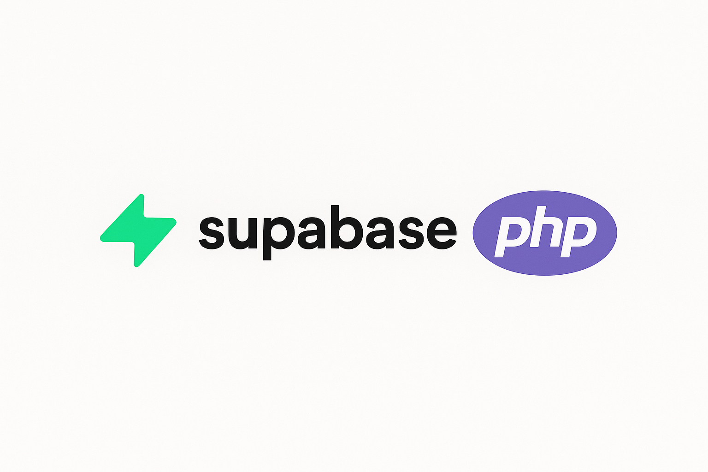

Modern modular Supabase SDK for PHP powered by independent packages.

---

## ✨ Features

- Modular architecture
- Fluent query builder
- Authentication & JWT
- Storage management
- Realtime subscriptions
- Edge Functions
- AI vector search
- Laravel integration
- Async support
- DTOs & typed responses
- PSR compliant
- Modern PHP 8.3+

---

# 📦 Installation

Install full ecosystem:

```bash
composer require supabase-php/supabase
```

---

# 📚 Included Packages

| Package | Purpose |
|---|---|
| `supabase-php/auth` | Authentication |
| `supabase-php/database` | PostgreSQL database APIs |
| `supabase-php/storage` | Object storage |
| `supabase-php/realtime` | Realtime WebSockets |
| `supabase-php/functions` | Edge Functions |
| `supabase-php/vector` | AI vector search |

---

## 🚀 Quick Start

```php
<?php

require 'vendor/autoload.php';

use Supabase\Supabase;

$supabase = new Supabase(
    url: 'https://your-project.supabase.co',
    apiKey: 'your-anon-key'
);

$users = $supabase
    ->db()
    ->table('users')
    ->select('*')
    ->execute();
```

---

## 🤝 Contributing

1. Fork repository
2. Create feature branch
3. Commit changes
4. Push branch
5. Open PR to `develop`

---

## 📜 License

MIT License

---

## ❤️ Philosophy

Built for developers who want:

- Clean APIs
- Modern architecture
- Scalable applications
- AI-ready infrastructure
- Enterprise-grade reliability
- Exceptional PHP developer experience

---

## 🌐 Links

- Packagist: https://packagist.org/packages/supabase-php/supabase
- Supabase: https://supabase.com

---

## ⭐ Support

If this project helps you, consider giving it a GitHub star.
